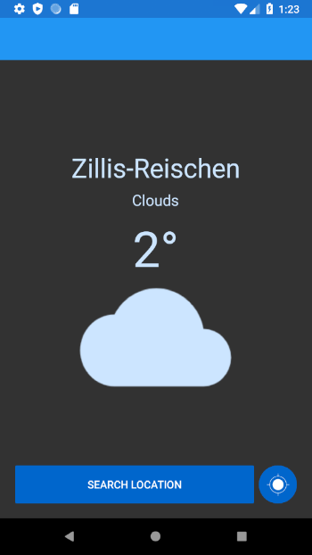
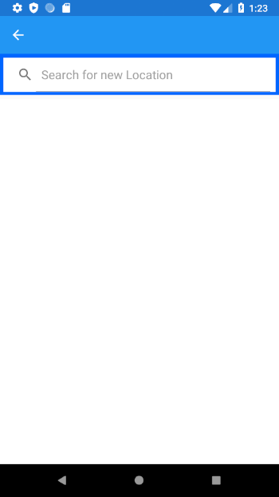
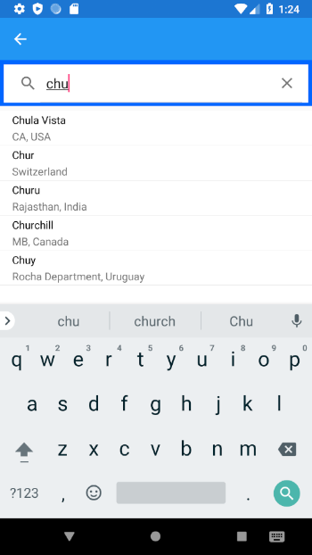

  <h1>⛅ MobileWeather</h1>
  You've never seen the weather this simple tbefore!

---

MobileWeather is a very simple and light-weight android app which shows you weather data for locations. You can get the weather for you current location or search for specific cities. No further explanation needed, go ahead and install it now!

  

  

  

